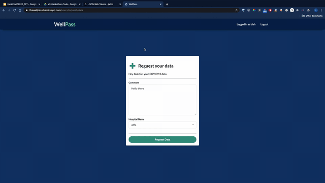

# WellPass

> Well pass is a blockchain powered identity verification application

Live preview of the application:

[https://thewellpass.herokuapp.com/](https://thewellpass.herokuapp.com/)
## Setup

Rename "config/config.env.env" to "config/config.env" and update the values/settings to your own

## Install Dependencies

```
npm install
```

## Run Server

```
npm run server
```

The server will be running on [http://localhost:5000/](http://localhost:5000/)

## Demo Video





## App Info

### Author

Sarthak Arora

Varun Ramnani

Pranav Garg

Akshit Suri

### Version

1.0.0