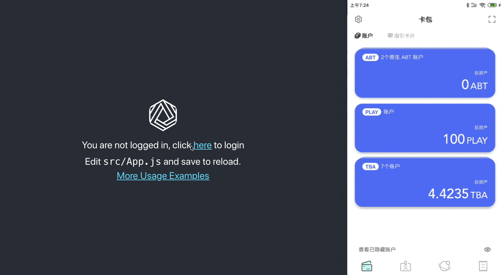

# DID:Auth with React

> Demo application that demonstrates how `@arcblock/did-connect` works with a web application bootstrapped with `create-react-app`.



## Requirements

- Node.js v10+

## Getting Started

```shell
make init
make run
```

## More Usage Examples

Checkout the [documentation for `@arcblock/did-connect`](https://arcblock.github.io/ux/?path=/docs/connect-introduction--page).
